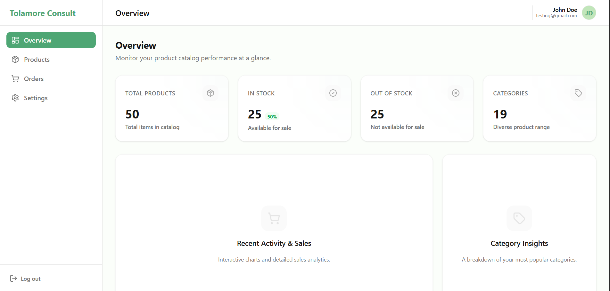
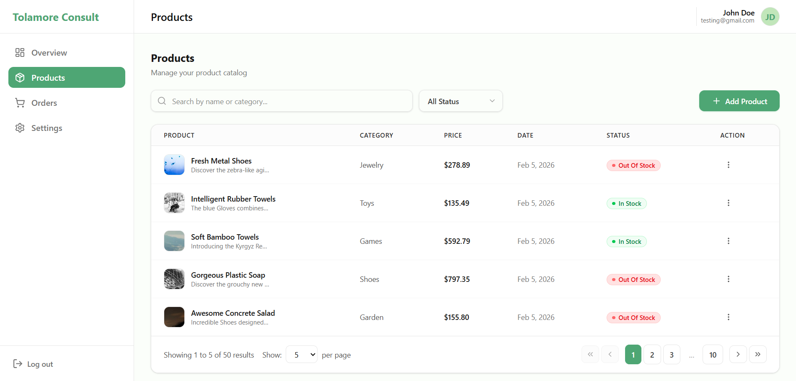
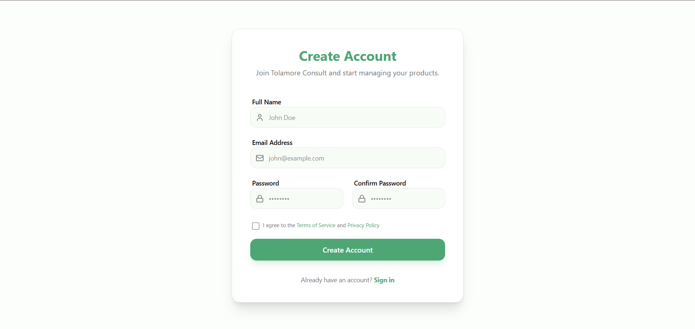
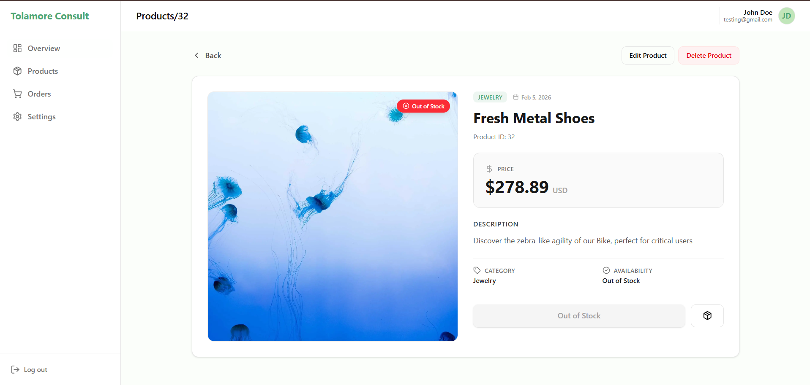
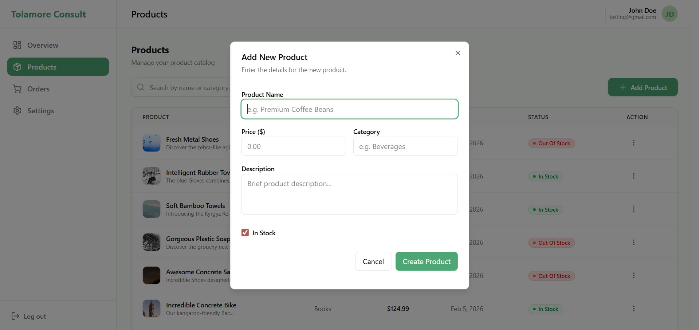

# 🌿 Product Management Dashboard

**Product Management Dashboard** This project is a technical assessment built for the first stage of the Frontend Engineer interview process.
It demonstrates how I approach building a clean, scalable, and user-friendly dashboard using modern frontend tools and patterns.

The application allows users to manage products from creating, editing, and deleting items to filtering and searching while maintaining a smooth user experience.


## 🚀 Tech Stack

-   **Framework**: [Next.js 14+](https://nextjs.org/) (App Router)
-   **Language**: [TypeScript](https://www.typescriptlang.org/)
-   **Styling**: [Tailwind CSS](https://tailwindcss.com/)
-   **Data Fetching**: [React Query](https://tanstack.com/query/latest)
-   **State Management**: [React Context](https://react.dev/reference/react/useContext)
-   **Icons**: [Lucide React](https://lucide.dev/)
-   **Notifications**: [Sonner](https://sonner.stevenly.me/)


## 📸 Screenshots

| Overview Dashboard | Product List |
| :---: | :---: |
|  |  |

| Login Page | Register Page |
| :---: | :---: |
|  |  |

| Product details | Add Product |
| :---: | :---: |
|  |  |


## 🛠️ Setup Instructions

Follow these steps to get the project running locally:

### 1. Prerequisites
Make sure you have Node.js installed.
For faster installs and better performance, Bun is recommended..

### 2. Install Dependencies
Run the following command in the root directory:
```bash
bun install
# or
npm install
```

### 3. Environment Variables
Create a `.env.local` file in the root file if needed and set your API base URL or use https://6983886f9c3efeb892a607f5.mockapi.io/api/v1 as your API base URL.

### 4. Run the Development Server
Start the dev server:
```bash
bun run dev
# or
npm run dev
```
Open [http://localhost:3000](http://localhost:3000) with your browser to see the result.

## 🧠 Technical Decisions

During development, several key architectural decisions were made to balance performance, maintainability, and user experience:

-   **React Query for Server State**: Chose `@tanstack/react-query` to handle all API interactions. This provides built-in caching, deduplication, and easy state synchronization (e.g., invalidating the list after a delete/edit).

-   **Simplified Auth Logic**: Implemented a custom `AuthContext` combined with Next.js **Middleware** for route protection. This is to prevent users from accessing protected routes without authentication.

-   **Server-Side Logic**: Leveraged MockAPI's filtering and pagination parameters. By offloading these tasks to the API, we ensure the frontend remains performant even with large datasets.

-   **Centralized Type System**: All TypeScript interfaces are centralized in `src/types/index.ts`, ensuring a single source of truth and preventing duplication across the codebase.

-   **Modular Component Design**: Developed reusable UI elements like `ConfirmDialog`, `StatCard`, and `ProductModal` to maintain a consistent look and feel while keeping page files clean.

## 📂 Project Structure

-   `src/app`: Next.js App Router pages and layouts.
-   `src/components`: Reusable UI components (StatCards, Modals, Tables).
-   `src/services`: API logic and React Query hooks.
-   `src/lib`: Utility functions and axios configuration.
-   `src/types`: Centralized TypeScript definitions.
-   `public`: Static assets and screenshots.

---

